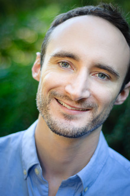

I'm a [David H. Smith Conservation Research
Fellow][smith] at the [University of Washington][safs] and [Northwest
Fisheries Science Center][nwfsc] in Seattle, Washington. I believe that the thoughtful visual display
of data and statistical models can powerfully inform conservation ecology and
help us understand the ecological risks associated with human activities.

In my [Ph.D. thesis][] at [Simon Fraser University][sfu], I examined the role
of variability and extreme events in population ecology. In my [M.Sc. thesis][]
at [Dalhousie University][dal], I explored patterns of expansion and serial
exploitation in global invertebrate fisheries. I also work on extinction risk:
I recently co-led [a study published in Science][paleobaselines] that used 23
million years of fossil data to ask what extinction risk in today's oceans
would look like without humans.

My [research](/cv.html#publications) broadly spans the field of quantitative
ecology across taxa (e.g. sea cucumbers, reef fish, salmon, moths, grizzly
bears), ecosystems (marine, freshwater, terrestrial), methods (empirical,
simulation, theoretical), spatial scale (regional, national, global), and time
periods (modern, historical, paleontological).

I [teach workshops](/cv.html#teaching) on data visualization and manipulation
for scientists. I also develop a number of R packages. With collaborators, I'm
developing packages to run fisheries stock assessment simulations with 
[Stock Synthesis][nefsc] software ([ss3sim]), measure ecological portfolio
effects ([ecofolio]), and simulate salmon metapopulation portfolios
([metafolio]).

[earth2ocean]: http://earth2ocean.org
[gg]: http://www.gg.ca/honour.aspx?id=75057&t=1&;ln=Anderson
[ss3sim]: http://cran.r-project.org/package=ss3sim
[ecofolio]: https://github.com/seananderson/ecofolio
[robustmeta]: https://github.com/seananderson/robustmeta
[my github]: https://github.com/seananderson
[nefsc]: http://nft.nefsc.noaa.gov/Stock_Synthesis_3.htm
[sfu]: http://sfu.ca/
[dal]: http://www.dal.ca/
[colophon]: colophon.html
[smith]: http://www.conbio.org/mini-sites/smith-fellows
[M.Sc. thesis]: http://dalspace.library.dal.ca//handle/10222/12813
[Ph.D. thesis]: https://theses.lib.sfu.ca/thesis/etd8887
[cucdoi]: http://dx.doi.org/10.1111/j.1467-2979.2010.00397.x
[metafolio]: http://cran.r-project.org/package=metafolio
[rem]: http://www.rem.sfu.ca/
[safs]: http://fish.washington.edu/
[paleobaselines]: http://doi.org/10.1126/science.aaa6635
[nwfsc]: www.nwfsc.noaa.gov/
