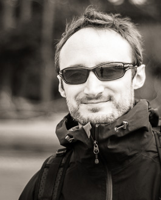

I believe that the thoughtful visual display of data and statistical models can powerfully inform conservation ecology.
I'm a Ph.D. Candidate and Fulbright Scholar in quantitative ecology at [Simon Fraser University][sfu] in the [Earth to Oceans group][earth2ocean], Vancouver, Canada. I want to figure out how we can use tools from financial portfolio management to create stable and productive ecosystems. I also [work on topics](/cv.html#publications) ranging from species extinction risk to predator-prey-environment interactions to fisheries stock assessment.

I [teach workshops](/cv.html#teaching) on data visualization and manipulation for scientists. I also develop a number of R packages. With collaborators, I'm developing packages to run fisheries simulations with [Stock Synthesis][nefsc] software ([ss3sim]), measure ecological portfolio effects ([ecofolio]), simulate salmon metapopulation portfolios (metafolio), and perform meta-analysis that is robust to correlated effect sizes ([robustmeta]).

I completed an M.Sc. at [Dalhousie][dal] with [Dr. Heike Lotze] working on trends, drivers, and ecosystem effects of expanding global invertebrate fisheries. In particular, we focussed on [patterns of serial exploitation in global sea cucumber fisheries][doi] and our paper was [featured in the journal Science][sciencemag]. My thesis won the [Canadian Governor General's Gold Medal][gg] as the top-ranked M.Sc. thesis at Dalhousie University in Engineering and Natural Sciences.

I'm [a bit nuts][colophon] about using the right tool for the job and I love to share my passion for these tools. I'm an avid user of the programming languages R, Markdown, LaTeX, Knitr, and Sweave. I'm also a [Vim] devotee and manage my work in [Git on Github][my github]. I [generate this site with Jekyll](/colophon.html).

[Vim]: http://en.wikipedia.org/wiki/Vim_(text_editor)
[dal]: http://dal.ca/
[doi]: http://dx.doi.org/10.1111/j.1467-2979.2010.00397.x
[earth2ocean]: http://earth2ocean.org
[gg]: http://www.gg.ca/honour.aspx?id=75057&t=1&;ln=Anderson
[ss3sim]: https://github.com/seananderson/ss3sim
[ecofolio]: https://github.com/seananderson/ecofolio
[robustmeta]: https://github.com/seananderson/robustmeta
[my github]: https://github.com/seananderson
[nefsc]: http://nft.nefsc.noaa.gov/Stock_Synthesis_3.htm
[sciencemag]: http://www.sciencemag.org/content/331/6014/129.1.full
[sfu]: http://sfu.ca
[Dr. Heike Lotze]: http://lotzelab.biology.dal.ca/
[colophon]: colophon.html
