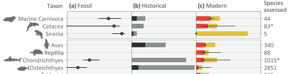
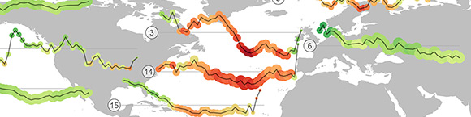
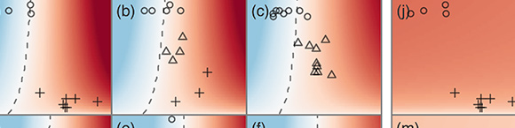
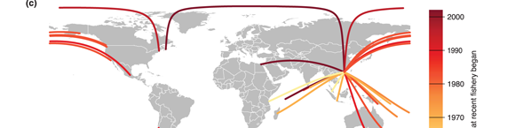
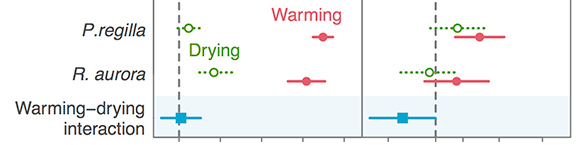

<a href="figures/moviestar.png" data-lightbox="moviestar"></img></a>

Movie collection. Each line represents a movie. The
length of a line indicates the year it was released. Higher-rated and more
popular movies on the <a href="www.imdb.com">IMDb</a> are brighter and layered
on top. The lines are arranged within movie genres and the genre categories
are sized so the density of lines within each genre is equal. Within each
genre the location of each line is random, so each run of the code produces a
slightly different appearance. Visualized in R.

<a href="figures/photos-exif.png" data-lightbox="photos-exif"></img></a>

Photography history. Colour indicates the average time of
day the photos were taken at. The height of each line represents the number of
photos taken per day. I extracted the event names and photo data from the file
structure and exif file information. Visualized in R — including the label
arrangement.

<a href="figures/instagram.jpg" data-lightbox="instagram"></img></a>

An Instagram account. I wrote a series of R functions to
read in the jpeg files, pick out the perceptually dominant colour hue, frame
the photo in that hue, order the photos by that hue, and create the
plot.

# Academic Figures

<a href="figures/harnik-etal-tree.png" data-lightbox="harnik-etal-2012"></img></a>

A summary of all known marine extinction risk data across ancient, historical, and modern times <a href="http://doi.org/10.1016/j.tree.2012.07.010">(Figure 2 in Harnik et al. 2013 TREE)</a>. I created this figure over the span of a year and hundreds of iterations with a NESCent working group on extinction risk in ancient and modern seas. A modified version was also used in a book chapter by <a href="http://www.sinauer.com/media/wysiwyg/samples/MCEC_Ch08.pdf">Lotze and McClenachan (2013)</a>. I drew some of the silhouettes on the on the left of the figure and obtained others from purchased stock images. The misaligned taxonomic labels on the left were due to an unfortunate last minute edit by the journal.

<a href="figures/ram-biomass-map.png" data-lightbox="ram-biomass-map"></img></a>

Global trends in biomass of fisheries stocks. Developed with Cole Monnahan at the University of Washington for the <a href="http://ramlegacy.org">RAM Legacy Stock Assessment Database</a>. The area of circles reflects the number of stock assessments for the region. The colour reflects the biomass relative to biomass at maximum sustainable yield. The horizontal lines show a reference of the mean historical biomass level.

<a href="figures/phillis-etal-ddt.png" data-lightbox="phillis-etal-2012"></img></a>

History of DDT contamination. (A) Public and scientific interest as news (dashed line) and research (solid line) publications on an annual basis, respectively. (B)  Total annual global DDT use. (C) Mean concentration of DDT in Mt. Everest ice core (dashed line), Arctic char tissue (solid line) and polar bear tissue (dotted line), scaled to the maximum value in each time series. Shaded regions indicate when the United States, Canada, Sweden, and Mexico began and subsequently banned use of DDT. Darker regions indicate multiple countries using DDT. <a href="http://seananderson.ca/papers/Phillis_etal_2012_Multiple_pathways_to_conservation_success.pdf">Figure 3 in Phillis et al. 2013 Conservation Letters</a>.

<!--<a href="figures/paleo-ext-proxy.png" data-lightbox="paleo-ext-proxy"></img></a>-->

<!--A summary of available data on marine bivalve and gastropod extinction patterns over the last 500 million years. Upper panels show whether survival favoured those with broad or narrow distributions and whether survival favoured epifaunal (living on top of the substrate) or infaunal (living within the substrate) genera. Subsequent panels show ocean acidification events, a number of environmental proxies, and extinction rates.-->

<!--<a href="figures/anderson-etal-portfolio-effect.png" data-lightbox="anderson-etal-portfolio-effect"></img></a>-->

<a href="figures/anderson-etal-seacuc.png" data-lightbox="anderson-etal-seacuc"></img></a>

Serial exploitation of global sea cucumber fisheries. Top left panel shows a reduction in time before a sea cucumber fishery reached time to peak catch. Upper right panel shows an increasing distance from Hong Kong over time. Lower map shows great circle arcs (flights) between cities with the largest population in each region and Hong Kong. Figure 5 in <a href="http://doi.org/10.1111/j.1467-2979.2010.00397.x">Anderson oet al. 2011 Fish and Fisheries</a> (<a href="http://seananderson.ca/papers/Anderson_etal_2011_seacucumbers_with_supplement.pdf">PDF</a>).

<!--<a href="figures/oregan-etal-meso.png" data-lightbox="oregan-etal-meso"></img></a>-->

