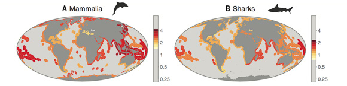
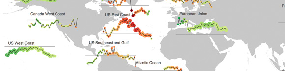
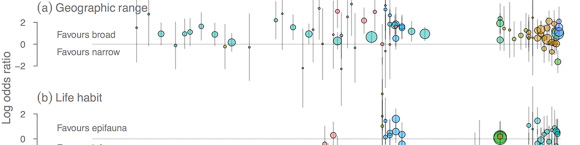

A selection of figures created with R. Click on a thumbnail to see the full version and caption.

# Academic figures

Distribution of 'intrinsic' or 'natural' extinction risk for animals in today's oceans. Figure 2 in <a href="http://doi.org/10.1126/science.aaa6635">Finnegan, Anderson, Harnik et al. 2015 Science</a>.

<!------->

Predictors of extinction risk in the marine fossil record over the last 23 million years. Figure 1 in <a href="http://doi.org/10.1126/science.aaa6635">Finnegan, Anderson, Harnik et al. 2015 Science</a>.

<!------->

Summarizing all known marine extinction risk across ancient, historical, and modern times. Figure 2 in <a href="http://doi.org/10.1016/j.tree.2012.07.010">Harnik et al. 2013 TREE</a>.

<!------->

History of DDT contamination. Figure 3 in <a href="http://doi.org/10.1111/j.1755-263X.2012.00294.x">Phillis et al. 2013 Conservation Letters</a> (<a href="https://dl.dropboxusercontent.com/u/254940/papers/Phillis_etal_2012_Multiple_pathways_to_conservation_success.pdf">PDF</a>).

<!------->

Trends in global fisheries exploitation. Developed with Cole Monnahan at the University of Washington for the <a href="http://ramlegacy.org">RAM Legacy Stock Assessment Database</a>. The area of circles reflects the number of stock assessments for the region. The colour reflects biomass relative to biomass at maximum sustainable yield.

<!------->

Serial exploitation of global sea cucumber fisheries. Figure 1 in <a href="http://doi.org/10.1111/j.1467-2979.2010.00397.x">Anderson oet al. 2011 Fish and Fisheries</a> (<a href="https://dl.dropboxusercontent.com/u/254940/papers/Anderson_etal_2011_seacucumbers_with_supplement.pdf">PDF</a>).

<!------->

<!--<a href="figures/anderson-etal-seacuc-fig1.jpg" data-lightbox="anderson-etal-seacuc-fig1"></img></a>-->

<!--
Serial exploitation of global sea cucumber fisheries. Figure 5 in <a href="http://doi.org/10.1111/j.1467-2979.2010.00397.x">Anderson oet al. 2011 Fish and Fisheries</a> (<a href="https://dl.dropboxusercontent.com/u/254940/papers/Anderson_etal_2011_seacucumbers_with_supplement.pdf">PDF</a>).
-->

<!------->

<!--<a href="figures/orzechowski-etal-2015-fig1.jpg" data-lightbox="orzechowski-etal-2015-fig1"></img></a>-->

<!--
TODO<a href="TODO">(Figure 1 in Orzechowski et al. 2015)</a>.
-->

# Non-academic figures

Movie collection. Each line represents a movie. The length of a line indicates the year it was released. Higher-rated and more popular movies on the <a href="www.imdb.com">IMDb</a> are brighter and layered on top. The lines are arranged within movie genres and the genre categories are sized so the density of lines within each genre is equal. Within each genre the location of each line is random, so each run of the code produces a slightly different appearance.

Photography history. Colour indicates the average time of day the photos were taken at. The height of each line represents the number of photos taken per day. I extracted the event names and photo data from the file structure and EXIF photo data.

An Instagram account. I wrote a series of R functions to read in images, select perceptually dominant colour hues, frame the photos in that hue, and order the photos.

