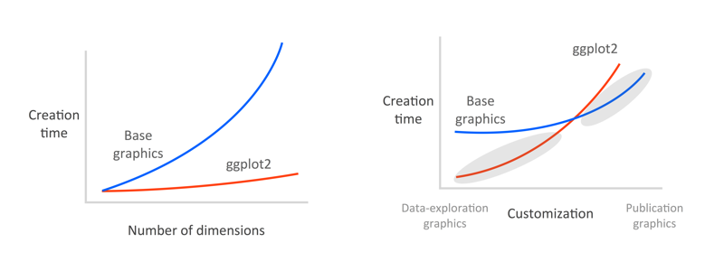

```{r knitr-options, cache=FALSE, echo=FALSE}
library("knitr")
opts_chunk$set(cache=TRUE, message=FALSE, tidy=FALSE, fig.height=4, fig.width=6, 
  fig.align = "center")
```

# An introduction to ggplot2

*February 2015, by Sean C. Anderson*

This page will help you teach yourself how to rapidly explore data with the ggplot2 R package. It was written as a self-study component for the FISH554 class at the University of Washington.

Work your way through this page. When you want to check your work, or if you get  stuck on an exercise, just click on the button `R source` and you'll see the R source code that created a figure.

# Learning objectives

By the end you should be able to:

- Understand the basic grammar of ggplot2 (data, geoms, aesthetics, facets).
- Make quick exploratory plots of your multidimensional data.
- Have an idea about how to start customizing ggplot2 figures.
- Know how to find help on ggplot2 when you run into problems.

# ggplot2 for rapid data exploration

ggplot2 is an R package by Hadley Wickham and Winston Chang that implements Wilkinson's Grammar of Graphics. The emphasis of ggplot2 is on rapid exploration of data, and especially high-dimensional data. Think of base graphic functions as drawing with data (examples of base graphic functions are `plot()`, `points()`, and `lines()`. With base graphics, you have complete control over every pixel in a plot but it can take a lot of time and code to produce a plot.

Although ggplot2 can be fully customized, it reaches a point of diminishing
returns. I tend to use ggplot2 and base graphics for what they excel at: ggplot2 
for rapid data exploration and base graphics for polished and fully-customized
plots for publication.

The following figure shows figure creation time vs. data dimensions and customization level for base graphics (blue) and ggplot2 (red). Left panel: It's remarkably easy to plot high-dimensional data in ggplot2 with, for example, colours, sizes, shapes, and panels. Right panel: ggplot2 excels at rapid visual exploration of data, but has some limitations in how it can be customized. Base graphics are fully customizable but can take longer to set up. I try and exploit the grey shaded areas: I use ggplot2 for data exploration and once I've decided on a small number of key plots, I'll use base graphics to make fully-customized plots if needed. Some people get really good at customizing ggplot and stick with it for all their plots, but since you've already learned the ways of base graphics in FISH554 I think you'll benefit from the strategy in this figure:



Good graphical displays of data require rapid iteration and lots of exploration. If it takes you hours to code a plot in base graphics, you're unlikely to throw it out and explore other ways of visualizing the data, and you're unlikely to explore all the dimensions of the data.

# Basics of the grammar

Let's look at some illustrative ggplot2 code:

```{r basics1}
library("ggplot2")
theme_set(theme_bw()) # use the black and white theme throughout
# fake data:
d <- data.frame(x = c(1:8, 1:8), y = runif(16),
  group1 = rep(gl(2, 4, labels = c("a", "b")), 2),
  group2 = gl(2, 8))
head(d)
ggplot(data = d) + geom_point(aes(x, y, colour = group1)) +
  facet_grid(~group2)
```

The basic format in this example is:

1.  `ggplot()`: start an object and specify the data

2.  `geom_point()`: we want a scatter plot; this is called a “geom”

3.  `aes()`: specifies the “aesthetic” elements; a legend is automatically created

4.  `facet_grid()`: specifies the “faceting” or panel layout

There are also statistics, scales, and annotation options, among others. At a minimum, you must specify the data, some aesthetics, and a geom. I will elaborate on these below. Yes, ggplot2 combines elements with `+` symbols! This may seem non-standard, although it has the advantage of allowing ggplot2 plots to be proper R objects, which can modified, inspected, and re-used (I provide some examples at the end).

There are two main plotting functions in ggplot2: `qplot` and `ggplot`. `qplot` is short for "quick plot" and is made to mimic the format of `plot` from base R. `qplot` requires less syntax for many common tasks, but has limitations — it's essentially a wrapper for `ggplot`. The `ggplot` function itself isn't complicated and will work in all cases. I prefer to work with just the `ggplot` syntax and will focus on it here. I find it easier to master one function that can do everything.

# Loading the data

We're going to work with morphological data from Galapagos finches, which is available from BIRDD: Beagle Investigation Return with Darwinian Data at <http://bioquest.org/birdd/morph.php>. It is originally from Sato et al. 2000 Mol. Biol. Evol. <http://mbe.oxfordjournals.org/content/18/3/299.full>.

I've saved a `.csv` version of this dataset for you. **Download the data `Morph_for_Sato.csv` [here](https://raw.githubusercontent.com/seananderson/ggplot2-FISH554/master/Morph_for_Sato.csv) and put it in your R working directory.**

Before we get started, we're going to clean the data up a bit. I've removed some columns and made the column names lower case. I've also removed all but one island. You can do that with this code:

```{r}
morph <- read.csv("Morph_for_Sato.csv")
names(morph) <- tolower(names(morph)) # make columns names lowercase
morph <- subset(morph, islandid == "Flor_Chrl") # take only one island
morph <- morph[,c("taxonorig", "sex", "wingl", "beakh", "ubeakl")] # only keep these columns
names(morph)[1] <- "taxon"
morph <- data.frame(na.omit(morph)) # remove all rows with any NAs to make this simple
morph$taxon <- factor(morph$taxon) # remove extra remaining factor levels
morph$sex <- factor(morph$sex) # remove extra remaining factor levels
row.names(morph) <- NULL # tidy up the row names
```

Take a look at the data. There are columns for taxon, sex, wing length, beak height, and upper beak length:

```{r look-data, eval=FALSE}
head(morph)
str(morph)
```

# Geoms

`geom` refers to a geometric object. It determines the “shape” of the plot elements. Some common geoms:

`geom`              Description
------              -----------
`geom_point()`      Points
`geom_line()`       Lines
`geom_ribbon()`     Ribbons, y range with continuous x values
`geom_polygon()`    Polygon, a filled path
`geom_pointrange()` Vertical line with a point in the middle
`geom_linerange()`  An interval represented by a vertical line
`geom_path()`       Connect observations in original order
`geom_histogram()`  Histograms
`geom_text()`       Text annotations
`geom_violin()`     Violin plot (another name for a beanplot)
`geom_map()`        Polygons on a map

Open the ggplot2 web documentation <http://docs.ggplot2.org/> and keep it open to refer back to it throughout these exercises.

First, let's experiment with some geoms using the `morph` dataset that you downloaded and cleaned up above. I'll start by setting up a basic scatterplot of beak height vs. wing length:

```{r geom1}
library("ggplot2")
ggplot(morph, aes(wingl, beakh)) + geom_point(alpha = 0.4)
```

Because there's lots of overplotting, I've set the alpha (opacity) value to 40%. Alternatively, we could have added some jittering. We'll do that below.

### Your turn

Experiment with ggplot2 geoms. Try applying at least 3 different geoms to the `morph` dataset. For example, try showing the distribution of wing length with `geom_histogram()` and `geom_density()`. You could also try showing the distribution of wing length for male and female birds by using `geom_violin()`. After you've experimented for a while, click on `R Source` to see the code behind the plots below.

```{r geom-examples, bootstrap.show.code=FALSE}
ggplot(morph, aes(wingl)) + geom_histogram(binwidth=1)
ggplot(morph, aes(wingl)) + geom_density()
ggplot(morph, aes(sex, wingl)) + geom_violin()
ggplot(morph, aes(taxon, wingl)) + geom_violin() + coord_flip() # coord_flip() rotates 90 degrees
ggplot(morph, aes(taxon, wingl)) + geom_boxplot() + coord_flip()
```

# Aesthetics

Aesthetics refer to the attributes of the data you want to display. They map the data to an attribute (such as the size or shape of a symbol) and generate an appropriate legend. Aesthetics are specified with the `aes()` function.

As an example, the aesthetics available for `geom_point()` are: `x`, `y`, `alpha`, `colour`, `fill`, `shape`, and `size`. (Note that ggplot tries to accommodate the user who’s never “suffered” through base graphics before by using intuitive arguments like `colour`, `size`, and `linetype`, but ggplot will also accept arguments such as `col`, `cex`, and `lty`.) Read the help files to see the aesthetic options for the geom you’re using. They’re generally self explanatory. Aesthetics can be specified within the data function or within a geom. If they’re specified within the data function then they apply to all geoms you specify.

Note the important difference between specifying characteristics like colour and shape inside or outside the `aes()` function: those inside the `aes()` function are assigned the colour or shape automatically based on the data. If characteristics like colour or shape are defined outside the `aes()` function, then the characteristic is not mapped to data. Here’s an example:

```{r echo=TRUE, bootstrap.show.code=TRUE}
ggplot(mpg, aes(cty, hwy)) + geom_point(aes(colour = class))
```

```{r echo=TRUE, bootstrap.show.code=TRUE}
ggplot(mpg, aes(cty, hwy)) + geom_point(colour = "red")
```

Let's play with mapping some of our data to aesthetics. I'll start with one example. I'm going to map the male/female value to a colour in our scatterplot of wing length and beak height. This time I'll use jittering instead of transparency to deal with overplotting:

```{r aes-example, bootstrap.show.code=TRUE}
ggplot(morph, aes(wingl, beakh)) +
  geom_point(aes(colour = sex),
    position = position_jitter(width = 0.3, height = 0))
```

### Your turn

Explore the `morph` dataset yourself by applying some aesthetics. You can see all the available aesthetics for a give geom by looking at the documentation. Either see [the website](http://docs.ggplot2.org/current/) or, for example, `?geom_point`

Some suggestions:

- try the same scatterplot but show upper beak length (`ubeakl`) with size
- try the same scatterplot but show the taxon with colour
- try the same scatterplot but show the upper beak length with colour (note how ggplot treats `ubeakl` differently than `taxon` when it picks a colour scale)
- try the same scatterplot but show the sex with a different shape
- combine all these: colour for taxon, shape for sex, and size for upper beak length

This last version is a bit silly, but it illustrates how quickly you can explore multiple dimensions with ggplot2.

```{r aes1, bootstrap.show.code=FALSE}
ggplot(morph, aes(wingl, beakh)) +
  geom_point(aes(size = ubeakl), alpha = 0.4)
```

```{r aes2, fig.width=9, bootstrap.show.code=FALSE}
ggplot(morph, aes(wingl, beakh)) +
  geom_point(aes(colour = taxon),
    position = position_jitter(width = 0.3, height = 0))
```

```{r aes3, fig.width=9, bootstrap.show.code=FALSE}
ggplot(morph, aes(wingl, beakh)) +
  geom_point(aes(colour = ubeakl),
    position = position_jitter(width = 0.3, height = 0))
```

```{r aes4, bootstrap.show.code=FALSE}
ggplot(morph, aes(wingl, beakh)) +
  geom_point(aes(shape = sex),
    position = position_jitter(width = 0.3, height = 0))

```{r aes5, fig.width=9, bootstrap.show.code=FALSE}
ggplot(morph, aes(wingl, beakh)) +
  geom_point(aes(shape = sex, size = ubeakl, colour = taxon),
    alpha = 0.4)
```

# Facets (small multiples)

In ggplot2 parlance, small multiples are referred to as "facets". There are two kinds: `facet_wrap()` and `facet_grid()`. `facet_wrap()` plots the panels in the order of the factor levels. When it gets to the end of a column it wraps to the next column. You can specify the number of columns and rows with `nrow` and `ncol`. `facet_grid()` lays out the panels in a grid with an explicit x and y position. By default all x and y axes will be shared among panels. However, you could, for example, allow the y axes to vary with `facet_wrap(scales = "free_y")` or allow all axes to vary with `facet_wrap(scales = free)`.

To specify the data frame columns that are mapped to the rows and columns of facets, separate them with a tilde. For example: `+ facet_grid(row_name~column_name)`. Usually you'll only give a row or column to `facet_wrap()`, but try and see what happens if you give it both. See the help `?facet_wrap`.

### Your turn

Try a scatterplot of beak height against wing length with a different panel for each taxon. Use `facet_wrap()`:

```{r facet1, bootstrap.show.code=FALSE}
ggplot(morph, aes(wingl, beakh)) +
  geom_point(alpha = 0.4) + facet_wrap(~taxon)
```

In some cases, it's useful to let the x or y axes have different scales for each panel. Try giving each panel a different axis here using `scales = "free"` in your call to `facet_wrap()`:

```{r facet2, fig.width=10, fig.height=8, bootstrap.show.code=FALSE}
ggplot(morph, aes(wingl, beakh)) +
  geom_point(alpha = 0.4) +
  facet_wrap(~taxon, scales = "free")
```

Now try using `facet_grid` to explore the same scatterplot for each combination of sex and taxa. (Remove the `scales = "free"` code for simplicity.)

```{r facet3, fig.width=10, fig.height=7, bootstrap.show.code=FALSE}
ggplot(morph, aes(wingl, beakh)) +
  geom_point(alpha = 0.4) + facet_grid(sex~taxon)
```

As another example, let's look at the distribution of wing length by sex with different panels for each taxa. Use a boxplot or violin plot to show the distributions.

```{r facet4, fig.width=9, fig.height=9, bootstrap.show.code=FALSE}
ggplot(morph, aes(sex, wingl)) + geom_violin() +
  facet_wrap(~taxon)
```

# Customizing ggplot2

So far we've used the default settings. Let's try applying a theme and adjust some of the annotation of our plots.

A useful theme built into ggplot2 is `theme_bw()`. You’ll notice that I set it as the default in this document back when I first loaded ggplot2. You can specify it for a specific plot like this:

```{r echo=TRUE, bootstrap.show.code=TRUE}
dsamp <- diamonds[sample(nrow(diamonds), 1000), ]
ggplot(mtcars, aes(wt, mpg)) + geom_point() + theme_bw()
```

Alternatively, the following plot shows the default theme. The grey is designed to match the typical darkness of a page filled with text to keep the plot from drawing too much attention.

```{r echo=TRUE, bootstrap.show.code=TRUE}
ggplot(mtcars, aes(wt, mpg)) + geom_point() + theme_grey()
```

A powerful aspect of ggplot2 is that you can write your own themes. See the ggthemes package for some examples.

An Edward Tufte-like theme:

```{r echo=TRUE, bootstrap.show.code=TRUE}
library("ggthemes")
ggplot(mtcars, aes(wt, mpg)) + geom_point() + geom_rangeframe() +
 theme_tufte()
```

Just what you wanted:

```{r echo=TRUE, bootstrap.show.code=TRUE}
ggplot(dsamp, aes(carat, price, colour = cut)) + geom_point() +
  theme_excel() + scale_colour_excel()
```

Here's an example custom theme:

```{r custom-theme, bootstrap.show.code=TRUE}
theme_example <- function (base_size = 12, base_family = "") {
  theme_gray(base_size = base_size, base_family = base_family) %+replace%
    theme(axis.text = element_text(colour = "grey50"),
          axis.title.x = element_text(colour = "grey50"),
          axis.title.y = element_text(colour = "grey50", angle = 90),
          panel.background = element_rect(fill = "white"),
          panel.grid.minor.y = element_blank(),
          panel.grid.minor.x = element_blank(),
          panel.grid.major = element_blank(),
          plot.background = element_blank()
  )
}
ggplot(mtcars, aes(wt, mpg)) + geom_point() + theme_example()
```

You can customize just about every aspect of a \ggtwo\ plot. We won't get into that today, but see the additional help resources at the end of this document.

### Your turn

Let's start by applying the black and white theme, `theme_bw()`. Try adding that on to the end of a plot showing the distribution of wing length by sex using `geom_violin()`. Save your plot to an object named `p` and `print()` it to show it. We'll re-use this plot in the next step.

```{r customizing1, bootstrap.show.code=FALSE}
p <- ggplot(morph, aes(sex, wingl)) + geom_violin() + theme_bw()
print(p)
```

Let's go one step further and remove all grid lines. See the included notes and the help for `?theme`. Hint: setting an argument to `element_blank()` will remove it. Add these elements to the object `p` and print `p` again. Hint: see the note "Exploiting the object-oriented nature of ggplot2" in the "Random tips" section of the notes.

```{r customizing2, bootstrap.show.code=FALSE}
p <- p + theme(panel.grid.major = element_blank(),
  panel.grid.minor = element_blank())
print(p)
```

And now let's set the x and y axis labels ourselves. Name them something more appropriate.

```{r customizing3, bootstrap.show.code=FALSE}
p <- p + xlab("Sex") + ylab("Wing length")
print(p)
```

Use the function `ggsave()` to save your plot to a PDF file.

```{r customizing4, bootstrap.show.code=FALSE}
ggsave(p, file = "wingl-violin.pdf", width = 6, height = 6)
```

# More examples

## Dot and line plots

ggplot2 can be useful for quickly making dot and line plots. For example, this is useful for coefficient plots. To illustrate how to make this style of plot, let's make a plot that shows a dot for the median and line segment for the quantiles. First, we'll calculate these values using the [dplyr package](http://cran.rstudio.com/web/packages/dplyr/vignettes/introduction.html) and [data pipes](http://cran.r-project.org/web/packages/magrittr/vignettes/magrittr.html). Run the following code:

```{r manipulate, bootstrap.show.code=TRUE}
# install.packages("dplyr")
library("dplyr")
morph_quant <- 
  morph %>%
  group_by(taxon) %>%
  summarise(
    l = quantile(wingl, 0.25)[[1]],
    m = median(wingl),
    u = quantile(wingl, 0.75)[[1]]) %>%
  # re-order factor levels by median for plotting:
  mutate(taxon = reorder(taxon, m, function(x) x)) 
```

### Your turn

Now make the plot. The final plot should have the taxa listed down the y-axis and the wing length value on the x axis. Use the geom `geom_pointrange()`. Because this geom only works for vertical line segments, you'll need to rotate the whole plot by adding `+ coord_flip()`. So, `ymax` and `ymin` refer to the maximum and minimum line segment values and `x` to the taxa, even though they will appear rotated in the end.

```{r pointrange-example, bootstrap.show.code=FALSE}
ggplot(morph_quant, aes(x = taxon, y = m, ymin = l, ymax = u)) +
  geom_pointrange() + coord_flip() +
  ylab("Wing length") + xlab("")
```

## Adding model fits to the data

ggplot2 can add model fits to the data to help visualize patterns. For example, it can quickly add linear regression lines, GLMs, GAMs, and loess curves. Let's add loess curves to scatter plots of beak height and wing length with a panel (facets) for male and female. See `?stat_smooth`.

```{r loess-example, bootstrap.show.code=TRUE}
ggplot(morph, aes(wingl, beakh)) +
  geom_point(alpha = 0.4) + facet_wrap(~sex) +
  stat_smooth(method = "loess")
```

You can add any model fit by specifying the function and the formula (see the examples in `?stat_smooth`). Alternatively, you can fit your own model, predict from it, and add the data with `geom_ribbon()`.

# Some final notes

## ggplot2's dirty little secret

1.  ggplot2 is easy to learn, but...

2.  You need to be a data-manipulation ninja to use it effectively.

With base graphics, you can work with almost any data structure you'd like, providing you can write the code to work with it. For example, you data could be in a list or a data frame. Or maybe it's scattered across multiple objects. ggplot2, on the other hand, requires you to think carefully about the data structure and then write one (possibly long) line of code. So, with base plotting you'll tend to spend lots of time writing plotting code. With ggplot2 you'll tend to spend time thinking beforehand, and then quickly write the code.

ggplot2 works with “long” format data or “tidy data” with each aesthetic or facet variable in its own column (see Hadley Wickham’s [pre-print on tidy data](http://vita.had.co.nz/papers/tidy-data.pdf)). So, for example, if we wanted a panel or colour for each level of a variable called `fishstock` then we’d need a column named `fishstock` with all the different values of `fishstock` in that column.

With the tidyr (or reshape2) and dplyr packages, you can get almost any dataset into shape for ggplot2 in a few lines. Sometimes this will take some serious thought along with pen and paper.

## Random tips

Jittering and statistics

:   ggplot2 has lots of built-in niceties like automatic position jittering and the addition of basic statistical models to your plots. Have a look through the help resources listed at the end of this document.

Axis labels

:   `xlab("Your x-axis label")`

Suppressing the legend

:   `theme(legend.position = none)`

Exploiting the object-oriented nature of ggplot2

:   Save the basic plot to an object and then experiment with different aesthetics, geoms, and theme adjustments.

```{r}
p <- ggplot(d) + geom_point(aes(x, y, colour = group1))
p + facet_grid(~group1) # try one way
p + facet_grid(~group2) # try another way
```

Horizontal error bars

:   Say you want to make a coefficient plot with the coefficients down the y-axis. You can either build the plot piece by piece with points and segments, or you can use `geom_pointrange()` and then rotate the axes with `+ coord_flip()`.

Axis limits and zooming

:   ggplot has two ways of adjusting the axis limits: `+ xlim(2, 5)` will “cut” the data at `2` and `5` and plot the data. `coord_cartesian(xlim = c(2, 5))` will zoom in on the plot while retaining the original data. This will, for example, affect colour scales.

Displaying and saving ggplot2 plots

:   If ggplot plots are generated in a function, they will be need to be wrapped in `print()` to display. There is a convenience function `ggsave("filename.pdf")`, which will save the last plot to a PDF and guess at reasonable dimensions. You can, of course specify which plot to save and the dimensions of the PDF. You can also use all the same methods of saving ggplot plots that you can use for base graphics.

Combining multiple ggplot panels

:   ggplot makes it easy to create multipanel figures with `facet_grid()` and `facet_wrap()`. But, sometimes you need to combine different kinds of plots in one figure or plots that require different data. One easy way to do this is with the `grid.arrange()` function from the gridExtra package. For example:

```{r grid.arrange}
df <- data.frame(x = 1:10, y = rnorm(100))
p1 <- ggplot(df, aes(x, y)) + geom_point()
p2 <- ggplot(df, aes(y)) + geom_histogram()
gridExtra::grid.arrange(p1, p2)
```

ggvis

:   [ggvis](https://github.com/rstudio/ggvis) is a partial successor to ggplot2 and is under rapid development. It focuses on implementing a similar grammar of graphics for web-based and possibly interactive output. Install it with `devtools::install_github("rstudio/ggvis")`.

## Finding help

The best (and nearly essential) help source is the website, which is largely based off the package help files. However, the website also shows the example plots and is easier to navigate: <http://docs.ggplot2.org/>. Don’t be afraid to keep it open whenever you’re using ggplot2.

There's also an [active ggplot2 discussion group](http://groups.google.com/group/ggplot2).

ggplot2 is [heavily featured](http://stackoverflow.com/questions/tagged/ggplot2) on stackoverflow.

Hadley wrote a [book on ggplot2](http://ggplot2.org/book/) and it was recently updated.

# Feedback

If you have any questions on the notes or exercises, or want to provide feedback, feel free to email me at sean "at" seananderson.ca.

<a rel="license" href="http://creativecommons.org/licenses/by-nc/4.0/deed.en_US"></a><br />This work is licensed under a <a rel="license" href="http://creativecommons.org/licenses/by-nc/4.0/deed.en_US">Creative Commons Attribution-NonCommercial 4.0 International License</a>.
